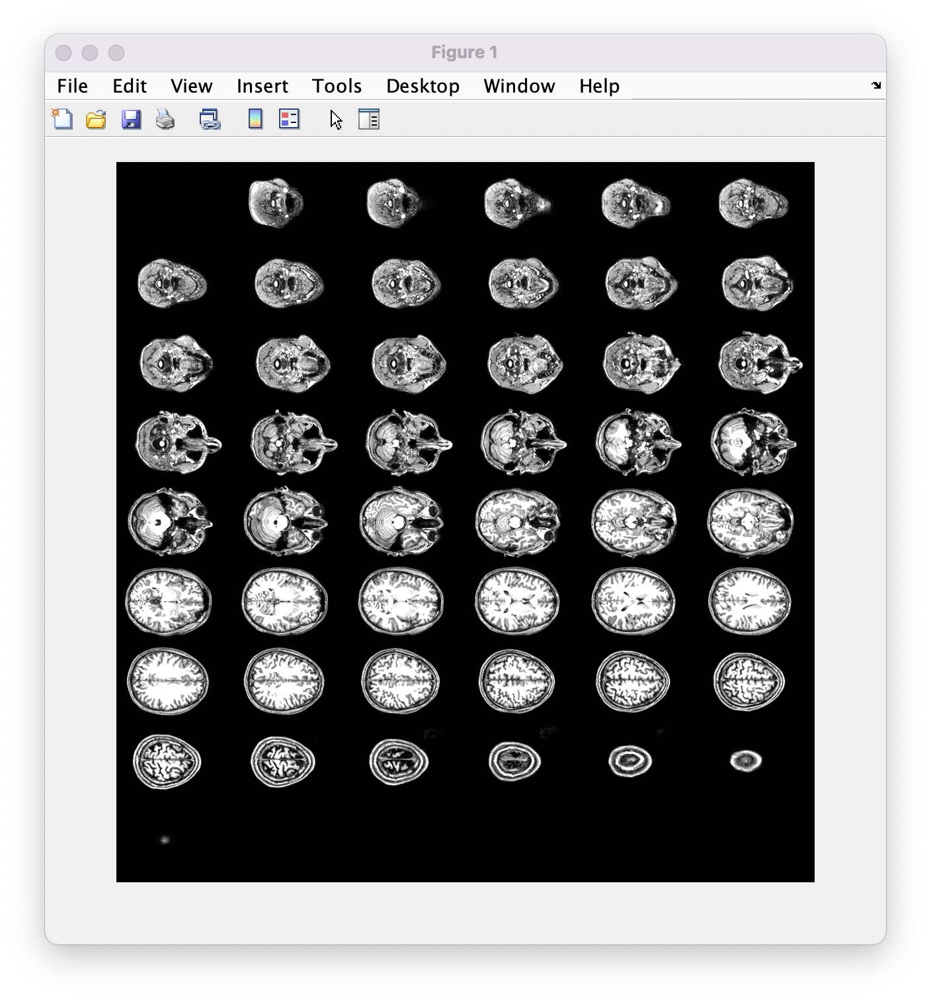
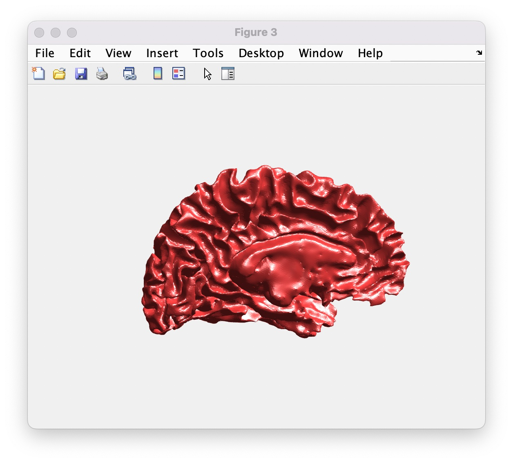

# megeyehs-code

ds, 2022-06-23

matlab / bash (to come if needed) code for looking at images, integrating with fieldtrip etc

Code in [this matlab file](check_anatomies.m)

To load images and get off the ground producing visualisations:

